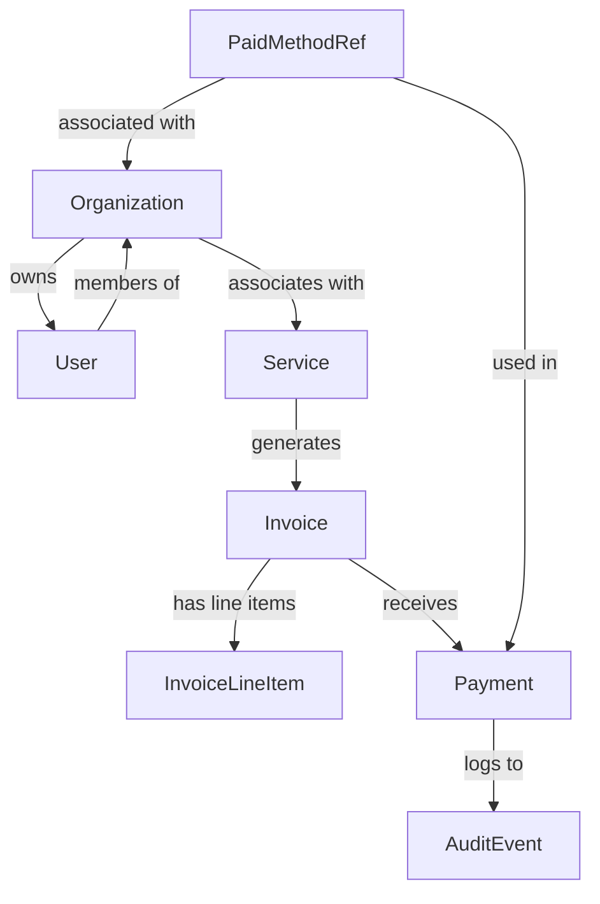

# Client Portal Product Specification
**Project:** 2Nspira Client Portal  
**Domain:** my.2nspira.com (or authenticated /account on 2nspira.com)  
**Version:** 1.0.0  
**Status:** Implementation-Ready  
**Date:** 2026-09-22

---

## Table of Contents

1. [Product Vision](#1-product-vision)
2. [User Roles](#2-user-roles)
3. [Information Architecture](#3-information-architecture)
4. [Dashboard Specification](#4-dashboard-specification)
5. [Services Experience](#5-services-experience)
6. [Billing and Payments](#6-billing-and-payments)
7. [Wallet / Payment Methods](#7-wallet--payment-methods)
8. [Invoice Specification](#8-invoice-specification)
9. [Automatic Payments](#9-automatic-payments)
10. [Data Model](#10-data-model)
11. [Security Boundaries](#11-security-boundaries)
12. [UX States](#12-ux-states)
13. [Notifications](#13-notifications)
14. [V1 vs Future](#14-v1-vs-future)
15. [UX/Design Language](#15-uxdesign-language)
16. [Acceptance Criteria](#16-acceptance-criteria)

---

## 1. Product Vision

### 1.1 Purpose
The 2Nspira Client Portal provides each client with a single, secure location to view their relationship with 2Nspira. It replaces ad-hoc email billing and disconnected information sources with a modern SaaS experience that feels native, not like a generic Stripe clone or legacy admin panel.

### 1.2 Core Capabilities (V1)
- **View active services and engagements** – What we're working on for their business today
- **View invoices and payment history** – Full billing transparency with downloadable receipts
- **Securely manage payment methods** – Tokenized storage via payment providers
- **Authorize payments** – Manual authorization flow for all transactions
- **Configure recurring/automatic payments** – Where supported by payment infrastructure
- **Access relevant documents** – Invoices, receipts, and account information

### 1.3 Experience Goals
- Modern SaaS feel, not generic admin panel
- Premium, calm, trustworthy aesthetic aligned with 2nspira.com
- Simple navigation without filler routes
- Enterprise-ready polish with clear security posture

---

## 2. User Roles

| Role | Can View | Can Modify | Can Delete | Use Cases |
|------|----------|------------|------------|-----------|
| **Account Owner** | All account data, all services, all invoices, payment methods, organization settings | All except audit logs | All except audit logs and system settings | Primary contact, ultimate authority for billing decisions |
| **Billing Administrator** | All financial data, invoices, payment history, payment methods | Payment methods (add/remove/set default), invoice preferences, autopay settings | Payment methods only with owner approval | Manages payments, invoices, payment processing |
| **Standard User** | Their own services (if multi-user org), view-only access to organization data | None without delegation | None | View account status, download invoices (V1 limitation) |
| **2Nspira Administrator** | All client data across portal | Organization-level settings | Delegated user accounts | Internal admin only, no client data modification |

### 2.1 Role Permissions Matrix

#### Account Owner
- `*:read` - Read all account data
- `services:*` - Full CRUD on services
- `invoices:*` - Full CRUD on invoices (view, download, mark paid)
- `payments:*` - View payment history, authorize payments
- `paymentMethods:*` - Add/remove/set default payment methods
- `organization:*` - Modify organization details
- `users:*` - Manage delegated users (if applicable)

#### Billing Administrator
- `invoices:read` - Read invoices
- `invoices:viewHistory` - View billing history
- `paymentMethods:crud` - Full CRUD on payment methods
- `payments:read` - View payment history
- `autopause:readwrite` - Manage autopay settings
- `organization:*` - Organization details read-only (no structural changes)

#### Standard User
- `services:read` - Read assigned services only
- `invoices:read` - Read invoices for their organization
- `paymentMethods:read` - View existing payment methods
- `payments:read` - View payment history (limited scope)

#### 2Nspira Administrator
- All read permissions across all organizations
- No write access to client data
- Can manage internal system settings

---

## 3. Information Architecture

### 3.1 Primary Navigation Routes (V1)

```
├─ /dashboard
│  ├─ Organization name display
│  ├─ Current services summary cards
│  ├─ Outstanding payments summary
│  ├─ Recent invoices list
│  ├─ Payment method summary
│  └─ Action buttons (Pay Now, Download Invoice)
│
├─ /services
│  ├─ Service listing grid
│  ├─ Service details modal/page
│  ├─ Status indicators
│  ├─ Billing frequency display
│  ├─ Price display (where appropriate)
│  └─ Document links to associated invoices
│
├─ /billing
│  ├─ Current balance display
│  ├─ Outstanding invoices list
│  └─ Payment history table
│
├─ /invoices
│  ├─ All invoices chronologically sorted
│  ├─ Invoice details view
│  ├─ Download PDF button
│  ├─ Mark as paid toggle
│  └─ Receipt display after payment
│
├─ /wallet (Payment Methods)
│  ├─ Existing payment methods list
│  ├─ Add new payment method form
│  ├─ Set default payment method
│  ├─ Remove payment method
│  └─ Masked account information display
│
├─ /account
│  ├─ Organization details
│  ├─ Edit organization profile
│  ├─ User management (if applicable)
│  └─ Support/contact preferences
│
└─ /support (Contact)
   ├─ Email address display
   ├─ Phone number display (where appropriate)
   ├─ Knowledge base links (V2)
   └─ Contact form link (V2)
```

### 3.2 Navigation Strategy
- **V1 focused**: Only essential routes for billing transparency
- No filler navigation items
- Support/contact is simple display (no ticketing V1)
- Project status/delimiters come in V2
- Contract management deferred to V2

---

## 4. Dashboard Specification

### 4.1 Layout Structure

#### Header Section
- **Left**: Organization name/logo (clickable to /account)
- **Center**: Welcome message "Welcome back, [Organization Name]"
- **Right**: User initials or avatar, logout button

#### Main Content Grid (2-column responsive)

**Column 1: Active Services (40%)**
```
[Service Card 1]
├─ Service name and description
├─ Status indicator (Active/Inactive/Paused)
├─ Billing frequency icon + label
├─ Next billing date
└─ Actions: [View Details]

[Service Card 2] (stack if more than 2 services)
...
```

**Column 2: Financial Summary (60%)**
```
┌─ Current Balance Box
│  ├─ Balance amount with status color
│  ├─ Due date display
│  └─ Primary CTA: [Pay Now] button
│
├─ Upcoming Payments Section
│  ├─ Next 3 invoices preview cards
│  ├─ Amounts and due dates
│  └─ Each shows payment method icon
│
├─ Recent Invoices (last 5)
│  ├─ Invoice number
│  ├─ Date range
│  ├─ Status badge (Paid/Unpaid/Pending)
│  └─ Download button
│
└─ Payment Methods Summary
   ├─ Default method display with icon
   ├─ Secondary methods (masked)
   └─ [Manage Payment Methods] link
```

### 4.2 Hierarchy and CTA Behavior

#### Priority Order
1. **Pay Now** - Highest priority, primary action when balance exists
2. **View Services** - Secondary exploration path
3. **Manage Wallet** - Tertiary path for payment setup
4. **Account Settings** - Quaternary, low urgency

#### Empty State (No Active Services)
```
┌─ Empty state illustration (calm, not alarming)
├─ "We don't have any active services yet"
└─ "Contact your 2Nspira account team to get started"
   [Button: Contact Support]
```

---

## 5. Services Experience

### 5.1 Service Card Display

Each service shows:
- **Service Name**: Bold, prominent (e.g., "Annual Advisory Retainer", "Web Hosting Package")
- **Status Badge**: 
  - Green = Active
  - Gray = Inactive/Paused
  - Yellow = Pending renewal review
- **Billing Frequency Icon + Label**: "Monthly" or "Annually"
- **Next Billing Date**: Calendar icon + date
- **Description**: Brief explanation (2-3 lines max)

### 5.2 Service Details Modal/Page

**Service Overview Section**
- Full service description
- Start date and expected renewal information
- Status change history timeline

**Billing Information**
- Billing frequency
- Current billing cycle dates
- Amount billed per cycle (where appropriate for transparency)

**Associated Documents**
- List of invoices linked to this service
- Download links to related contracts or deliverables (V2)

**Service Actions**
- Pause/activate service (owner/admin only)
- Request modification (triggers workflow V2)
- View documentation link

### 5.3 Service Status Indicators

| Status | Badge Color | Meaning |
|--------|-------------|---------|
| Active | Green | Service is current and billing normally |
| Inactive | Gray | Service suspended per agreement |
| Paused | Orange | Temporarily paused with resumption date |
| Renewal Due | Yellow | Within 30 days of renewal review |

---

## 6. Billing and Payments

### 6.1 Viewing Outstanding Balance

#### Location: Dashboard and /billing pages

**Balance Display Elements**:
- Numeric balance (e.g., "$2,450.00")
- Status indicator with color coding:
  - Green = Fully paid
  - Yellow = Partially paid
  - Red = Overdue
- Due date prominently displayed
- Days until due counter (if applicable)

#### Actions Available
- [Pay Now] - Direct to payment flow
- [Download Invoice] - PDF download
- [Add Payment Method] - Open wallet

### 6.2 Reviewing Invoices

**Invoice List Page**: Chronologically sorted, newest first

Each invoice card displays:
- **Invoice Number** (e.g., "INV-2026-089")
- **Issue Date**
- **Due Date**
- **Amount**
- **Status Badge** (Paid/Unpaid/Pending)
- **Download Button**

#### Invoice Details View

**Header Section**:
- Invoice number and status
- Issue date, due date, display dates
- Organization name
- Contact information for inquiries

**Line Items Table**:
- Description of each charge
- Quantity (1 or as applicable)
- Unit price
- Line total

**Summary Section**:
- Subtotal
- Tax breakdown (if applicable)
- Discounts (if any)
- Total amount due

**Actions**:
- [Download PDF] - Full invoice with official letterhead
- [Print] - Native print dialog
- [Mark as Paid] - If not yet paid
- [Add Payment Method] - If balance outstanding

### 6.3 Paying an Invoice

#### Manual Authorization Flow (V1 Requirement)

**Step 1: Amount Confirmation**
```
┌─ Payment Summary Box
│  ├─ "Amount to pay: $X,XXX.XX"
│  ├─ Breakdown if partial payment allowed
│  └─ [Confirm] button
│
├─ Payment Method Selection (if multiple configured)
│  ├─ Default method selected
│  ├─ Alternative methods listed
│  └─ Radio buttons for selection
│
├─ Authorization Language
│  └─ Explicit consent checkbox:
│     "I authorize 2Nspira to charge $X,XXX.XX 
│      to [Payment Method] on [Date]"
│
└─ Primary CTA: [Authorize Payment]
```

**Step 2: Payment Processing**
- Loading state with appropriate messaging
- Success: Receipt display
- Error: Clear error message + retry option

### 6.4 Failed Payments

**States to Handle**:
- **Expired Card**: "Your card expired on [date]. Please update your payment method."
- **Insufficient Funds**: "Payment declined due to insufficient funds."
- **Bank Rejected**: "Your bank has rejected this transaction."

**Actions Available**:
- [Try Again] - Retry same transaction
- [Add New Payment Method] - Alternative option
- Contact support link (for complex issues)

### 6.5 Receipt Display

After successful payment:
```
┌─ Success State
│  ├─ Checkmark icon
│  ├─ "Payment Authorized" or "Payment Processed"
│  ├─ Amount and invoice number
│  ├─ Transaction ID (if available from provider)
│  └─ [Download Receipt] button (PDF)
```

---

## 7. Wallet / Payment Methods

### 7.1 Adding a Payment Method

**Card Form Fields**:
- Card number (masked input with validation)
- Expiration date
- CVV (3 or 4 digits, masked)
- Cardholder name
- Billing address (ZIP code minimum for US cards)

**Alternative Methods**:
- ACH/Bank Transfer: Routing number, account number
- Zelle/Other: Provider-specific handling per gateway
- Cryptocurrency wallets (V2 consideration): Address, network selection

### 7.2 Payment Method Display

**List View Elements**:
- Card brand icon (Visa, Mastercard, etc.)
- Last 4 digits display (e.g., "•••• 4242")
- Expiration date
- Account type label (Credit/Debit)
- Status indicator:
  - Active green checkmark
  - Default badge
  - Expired/warning icon

**Masked Information**:
- Full account number never displayed
- Name shown as "John D." or initial + last name only
- Bank name may be masked to protect privacy

### 7.3 Authorization/Consent Language

When adding payment methods:
```
┌─ Authorization Banner
│  ├─ Title: "Payment Method Authorization"
│  ├─ Body text:
│     "By saving this payment method, you authorize 
│     2Nspira to store and use this information for 
│     billing purposes. Your data is processed securely 
│     by our payment providers and is not stored as 
│     raw card or bank account numbers."
│  └─ Checkbox: "I understand and agree" (required)
```

### 7.4 Removing Payment Methods

**Deletion Flow**:
1. Show warning: "Removing this payment method will prevent it from being used for future charges"
2. Confirm removal button
3. Remove and show success message

**Owner/Admin Only**: Standard users may not remove methods (V1 limitation)

---

## 8. Invoice Specification

### 8.1 Required Invoice Fields

| Field | Type | Required | Example |
|-------|------|----------|---------|
| invoiceNumber | String | Yes | "INV-2026-089" |
| issueDate | Date | Yes | "2026-09-22" |
| dueDate | Date | Yes | "2026-10-22" |
| organizationName | String | Yes | "Acme Corporation" |
| clientName | String | Yes | "Acme Corporation" |
| subtotal | Decimal | Yes | "2,450.00" |
| taxAmount | Decimal | Optional | "0.00" or applicable amount |
| totalAmount | Decimal | Yes | "2,450.00" |
| balanceDue | Decimal | Yes | "2,450.00" |
| paymentStatus | Enum | Yes | "unpaid/paid/partially-paid/overdue" |
| lineItems | Array | Yes | See below |
| invoiceNotes | String | Optional | Payment terms, notes |
| pdfUrl | URL | System-generated | Auto-generated PDF |

### 8.2 Line Item Structure

```json
{
  "service": "Annual Advisory Retainer",
  "description": "Monthly advisory services - September 2026",
  "quantity": 1,
  "unitPrice": "2,450.00",
  "total": "2,450.00"
}
```

### 8.3 Invoice Actions (Customer-Side)

- [Download PDF] - Always available
- [Print] - Native print dialog trigger
- [Mark as Paid] - Only if not yet paid
- [Add Payment Method] - If balance outstanding
- Share/Email invoice link (if enabled) - V2

---

## 9. Automatic Payments (Autopay)

### 9.1 Consent Flow Elements

**Initial Autopay Setup**:
```
┌─ Autopay Configuration Form
│
│  Field: Enable Autopay
│  Type: Toggle switch
│  Label: "Enable automatic payments"
│  Description: "We'll automatically charge your payment method 
│                 for invoices due. You can disable this anytime."
│
│
│  Field: Billing Cadence
│  Type: Radio buttons
│  Options:
│    - "Charge on invoice due date" (default)
│    - "Charge immediately when invoice issued" (for same-day)
│    - "Charge every X days" (if supported by provider)
│
│
│  Field: Payment Method Selection
│  Type: Dropdown (existing methods only)
│  Default: Currently selected payment method
│
│
│  Field: Authorization Language
│  Type: Checkbox (required)
│  Text: "I authorize 2Nspira to charge my default payment method 
│        for future invoices. I understand I can disable this 
│        at any time by contacting our team or updating my settings."
│
│
│  Primary CTA: [Enable Automatic Payments]
│
└─ Audit Trail Display
   ├─ "Autopay enabled on" date display
   └─ Link to view authorization history (V2)
```

### 9.2 Autopay Management

**Toggle Controls**:
- **Enabled state**:
  - Green checkmark
  - Next scheduled charge display
  - [Disable] button requires confirmation
  
- **Disabled state**:
  - Grayed out indicator
  - [Enable] button available
  - "No automatic payments configured" message

### 9.3 Audit Trail Requirements

All autopay changes must be logged:
```json
{
  "eventType": "autopay.updated",
  "timestamp": "2026-09-22T17:30:00Z",
  "actorId": "user-12345",
  "organizationId": "org-abcde",
  "previousState": {"enabled": false},
  "newState": {"enabled": true, "cadence": "onDueDate"},
  "ipAddress": "192.168.1.1"
}
```

### 9.4 Disabling Autopay

**Deactivation Flow**:
1. Confirm disabling autopay
2. Display impact: "Disabling autopay means invoices will be due immediately upon generation, and you'll need to pay manually."
3. Final confirmation button
4. Update audit trail immediately

---

## 10. Data Model

### 10.1 Core Entities and Relationships



### 10.2 Entity Definitions

#### Organization
- **Purpose**: Top-level tenant/container for client account
- **Key Fields**:
  - id (UUID)
  - name (string)
  - industry (string: optional)
  - address (object: street, city, state, zip, country)
  - settings (object: preferences, theme)
- **Relationships**:
  - Has many Users
  - Has many Services
  - Has many Invoices
  - Has many PaymentMethodRefs

#### User
- **Purpose**: Human interacting with the portal
- **Key Fields**:
  - id (UUID)
  - email (string, unique across system)
  - name (string)
  - role (enum: owner/admin/billing_admin/standard)
  - isActive (boolean)
- **Relationships**:
  - Belongs to Organization
  - Has Membership records

#### Service
- **Purpose**: Represents a purchased service/product
- **Key Fields**:
  - id (UUID)
  - name (string)
  - description (string)
  - status (enum: active/inactive/paused)
  - billingFrequency (enum: monthly/quarterly/yearly/onetime)
  - startDate (date)
  - price (decimal, optional for custom quotes)
  - renewalDate (date)
- **Relationships**:
  - Belongs to Organization
  - Has many Invoices

#### Invoice
- **Purpose**: Financial document generated from service billing
- **Key Fields**:
  - id (UUID)
  - invoiceNumber (string, unique per org)
  - status (enum: drafted/issued/paid/voided/cancelled)
  - issueDate (date)
  - dueDate (date)
  - subtotal (decimal)
  - taxRate (decimal, optional)
  - taxAmount (decimal)
  - totalAmount (decimal)
  - balanceDue (decimal)
- **Relationships**:
  - Belongs to Organization
  - Has many LineItems
  - Has PaymentMethodRef used for payment
  - Logged AuditEvents

#### InvoiceLineItem
- **Purpose**: Individual charge on an invoice
- **Key Fields**:
  - id (UUID)
  - serviceId (references Service)
  - description (string)
  - quantity (decimal/integer)
  - unitPrice (decimal)
  - total (decimal)
- **Relationships**:
  - Belongs to Invoice
  - Links to Service

#### PaymentMethodRef
- **Purpose**: Tokenized payment method stored securely
- **Key Fields**:
  - id (UUID)
  - type (enum: card/ach/zelle/cryptocurrency)
  - brand (string: Visa/Mastercard/AmericanExpress/etc.)
  - lastFourDigits (string, masked)
  - expirationDate (date)
  - status (enum: active/expired/rejected/processing)
  - isDefault (boolean)
  - providerId (references payment gateway)
- **Relationships**:
  - Belongs to Organization
  - Used in Payments

#### Payment
- **Purpose**: Recorded transaction of funds
- **Key Fields**:
  - id (UUID)
  - status (enum: processing/succeeded/failed/refunded)
  - amount (decimal, positive for charges, negative for refunds)
  - invoiceId (references Invoice, nullable if direct payment)
  - paymentMethodRefId (references PaymentMethodRef)
  - transactionId (string from payment provider)
  - timestamp (timestamp)
- **Relationships**:
  - Belongs to Organization
  - Links to Invoice (optional)
  - Uses PaymentMethodRef

#### AuditEvent
- **Purpose**: Immutable record of sensitive changes
- **Key Fields**:
  - id (UUID)
  - eventType (string enum: paymentMethod.added/paymentMethod.removed/autopay.enabled/etc.)
  - targetId (UUID or string reference)
  - targetType (string: PaymentMethodRef/AutopaySettings)
  - actorId (UUID)
  - previousValue (any, if applicable)
  - newValue (any, if applicable)
  - timestamp (timestamp)
  - ipAddress (string, for geo-location)
- **Relationships**:
  - Belongs to Organization

### 10.3 Audit Log Requirements

**Critical events requiring audit**:
- Payment method addition or removal
- Payment authorization
- Autopay enable/disable toggle
- Role change for users
- Organization settings changes (billing-related)
- Invoice status changes (draft -> issued, mark paid actions)

**Storage**: Immutable, append-only log accessible to admin/internal tools.

---

## 11. Security Boundaries

### 11.1 Authentication & Authorization

**Access Requirements**:
- All routes require valid session token
- Session tokens use secure httpOnly cookies
- Token expiry: 24 hours default (configurable)
- Logout invalidates all sessions

**Role-Based Access Control**:
- Permission checks on every route and action
- Middleware enforces least privilege by default
- Audit logs for all sensitive operations

### 11.2 Tenant Isolation

**Organization-Level Security**:
- Each Organization has separate tenant ID
- SQL query filters: `WHERE organization_id = ?`
- Never join organizations in same query
- Row-level security enforced at database layer

### 11.3 Payment Provider Tokenization

**PCI Compliance Strategy**:
```
┌─ Client provides card/bank details
├─ Payment gateway (Stripe/Braintree/etc.) stores token
├─ Token returned to client portal
└─ Portal NEVER sees or stores raw card numbers
```

**What Portal Stores**:
- Token string from provider (not actual PAN)
- Masked last 4 digits for display
- Expiration date
- Provider metadata

**What Portal Does NOT Store**:
- Primary Account Number (PAN)
- CVV/Security codes
- Full cardholder name
- Full billing address

### 11.4 PCI-Sensitive Boundaries

| Component | PCI Requirement | Implementation |
|-----------|----------------|----------------|
| Payment forms | PCI-DSS SAQ-A or A-EP | Use provider-hosted iframe where possible |
| Token handling | PCI DSS scope boundary | Tokens only, never PANs |
| Audit logs | PCI DSS Req 10.2 | Immutable logs of payment events |
| Session management | PCI DSS Req 6.5 | Secure cookies, expiry, refresh |

### 11.5 Secrets Management

**Never Exposed Client-Side**:
- API keys for payment providers
- Database credentials
- Internal service accounts
- Encryption keys

**Storage**: All secrets stored in environment variables or secure vault, never in client code or browser storage.

### 11.6 Audit Requirements

**Required Logging**:
- Authentication attempts (success/failure)
- Sensitive data access (invoices, payment methods)
- Role changes
- Payment method additions/removals
- Autopay configuration changes
- Invoice status modifications

**Log Retention**: Minimum 7 years for financial audit trail.

---

## 12. UX States

### 12.1 Loading States

**General Pattern**:
- Skeleton screens matching layout structure
- Subtle loading animation (pulse or spin)
- Never show "loading..." text only

**Specific Locations**:
- Dashboard grid items: Individual skeleton cards
- Service details modal: Background blur + overlay skeleton
- Wallet form fields: Input skeletons with placeholder patterns
- Payment processing: Full-page spinner with message

### 12.2 Success States

**Payment Authorization**:
```
┌─ Large green checkmark icon (48px+)
├─ Bold headline: "Payment Authorized"
├─ Details section:
│  ├─ Amount paid
│  ├─ Invoice number (if applicable)
│  └─ Transaction reference (optional)
│
├─ Primary action: [Download Receipt]
└─ Secondary text: "Your payment has been processed successfully."
```

**Service Activation**:
```
┌─ Green checkmark icon
├─ "Service activated successfully"
└─ Redirect to service overview after 1-2 seconds
```

### 12.3 Error States

**Generic Errors**:
- Icon: Gray exclamation mark or error symbol
- Title: Clear, human-readable message
- Description: Additional context if helpful
- Actions: [Try Again], [Contact Support] buttons

**Specific Payment Errors**:
| Error | Message | Action |
|-------|---------|--------|
| Card Declined (generic) | "Your payment could not be processed. Please try again or use a different payment method." | Try Again / Add New Method |
| Insufficient Funds | "This card does not have sufficient funds for this amount." | Try Different Method / Pay Later |
| CVV Invalid | "The security code on your card is incorrect." | Verify Card Details |
| Expired Card | "Your card has expired. Please update your payment information." | Update Payment Method |

### 12.4 Empty States

**No Services Yet**:
- Gentle illustration (minimal line art)
- Headline: "We don't have any active services yet"
- Subtext: "Contact your 2Nspira account team to get started"
- Button: [Contact Support] or link to email

**No Invoices Yet**:
- Similar approach, messaging specific to billing timeline
- "Get your first invoice when you purchase services"

### 12.5 No Authenticated User State (Redirect)

If session invalid/missing during navigation:
- Immediate redirect to login (no flash message needed)
- URL fragment or query param preserved if applicable

### 12.6 Expired Card States

**Dashboard Display**:
- Existing cards still list but with warning icon
- Primary CTA highlights [Update Payment Method]
- Messages: "Your primary payment method has expired. Update to continue receiving services."

**Wallet Page**:
- List shows expiration status for each method
- Expired methods can be removed or re-added
- Warning banner when default method expired

---

## 13. Notifications

### 13.1 V1 Notification Requirements

**Email Notifications Only (V1)**:
- No in-app notification system yet (V2)
- Simple email for critical events

| Event | Priority | Subject Line | Frequency |
|-------|----------|--------------|-----------|
| Invoice generated | High | "[Organization] New invoice available" | Per occurrence |
| Payment due reminder | Medium | "[Organization] Invoice due in X days" | 3, 7 days before due date |
| Payment successful | Medium | "[Organization] Payment received" | Per payment |
| Payment failed | High | "[Organization] Payment authorization needed" | Immediate |
| Card expiring (30+ days) | Low | "Your payment method will expire soon" | At 60, 45, 30 days notice |
| Autopay disabled | Medium | "[Organization] Automatic payments suspended" | On disable |
| Service renewal due | Low | "[Organization] Your service will renew on X" | 14 days before |

### 13.2 V2 Notification Enhancements (Out of Scope)

**Deferred to V2**:
- In-app notification center
- Mobile push notifications
- SMS notifications for urgent events
- Payment failure escalation flow
- Document delivery confirmations

---

## 14. V1 vs Future

### 14.1 In-Scope for V1 (This Release)

✅ **Core Capabilities**:
- Secure login and session management
- Client dashboard with financial summary
- Services overview and details
- Invoice viewing and downloading
- Payment history display
- Payment method management (add/remove/set default)
- Manual payment authorization flow
- Autopay configuration where supported by provider
- Basic organization/account profile management

### 14.2 Out of Scope for V1 (Future Releases)

❌ **Deferred Capabilities**:
- Support tickets and case management
- Real-time project status updates
- Deliverables download/management
- Contract e-signature workflow
- Usage analytics dashboards
- AI concierge/chatbot assistance
- Service upgrade/downgrade workflows
- Client messaging chat interface
- Rich automation rules engine
- Budget tracking tools
- Expense reimbursement requests

### 14.3 Technical Debt (V2 Considerations)

**Not Implemented V1**:
- Multi-currency support (single currency only V1)
- Multi-language localization
- Advanced tax calculation rules
- Bulk invoice generation
- API endpoints for integrations
- Webhook notifications
- Single Sign-On (SSO) integration

---

## 15. UX/Design Language

### 15.1 Design Principles

**Visual Identity Alignment**:
- Colors, typography, and spacing match 2nspira.com
- Premium feel: ample white space, refined typography
- Calm aesthetic: soft transitions, not jarring effects
- Trustworthy: clear labels, predictable behaviors

**What It Should NOT Feel Like**:
- Generic admin panel (gray, dense, cluttered)
- Stripe clone (too utilitarian, lacks brand)
- Legacy billing portal (dated visual language)

### 15.2 Component Guidance

#### Typography Scale
```
Display:   28px / line-height 36px (Headlines)
Heading 1: 24px / line-height 30px (Page headers)
Heading 2: 20px / line-height 24px (Section headings)
Body:      16px / line-height 24px (Primary text)
Small:     14px / line-height 20px (Captions, labels)
```

#### Color Palette (aligned with 2nspira.com)

| Role | Value | Usage |
|------|-------|-------|
| Primary Blue | `#1E40AF` | Buttons, links, primary actions |
| Success Green | `#059669` | Active status, successful states |
| Warning Orange | `#F59E0B` | Caution, warnings, partial states |
| Danger Red | `#DC2626` | Errors, declined payments |
| Neutral Gray 1 | `#374151` | Text primary |
| Neutral Gray 2 | `#6B7280` | Text secondary |
| Neutral Gray 3 | `#D1D5DB` | Borders, dividers |
| Background Light | `#F9FAFB` | Page backgrounds |

#### Button Styles

**Primary Action**:
```css
Background: Primary Blue (#1E40AF)
Text: White (#FFFFFF)
Border-radius: 8px
Font-weight: 500
Height: 40px
Hover: Slightly darker background
```

**Secondary Action**:
```css
Background: Transparent (#FFFFFF)
Border: 1px solid #D1D5DB
Text: Primary Blue
Font-weight: 500
Border-radius: 8px
Hover: Darker border
```

**Danger Action**:
```css
Background: Danger Red (#DC2626)
Text: White (#FFFFFF)
Uses Primary button style, different color
```

### 15.3 Iconography

- Use consistent icon set (Lucide or similar)
- Stroke width: 2px
- Size scale: 20px for labels, 48px+ for hero states
- Outlines only, no filled icons except status indicators

### 15.4 Layout Guidelines

**Card Design**:
- Padding: 24px (desktop), 20px (mobile)
- Border-radius: 12px
- Background: White with subtle shadow
- Border: 1px solid #E5E7EB on hover

**Spacing System**:
```
xs: 8px
sm: 12px
md: 16px
lg: 24px
xl: 32px
```

---

## 16. Acceptance Criteria (V1)

### 16.1 Functional Requirements

#### Authentication & Dashboard
- [ ] Login redirects to `/dashboard` after successful authentication
- [ ] Dashboard displays organization name and current services within 2 seconds of login
- [ ] Logout works and clears all session data
- [ ] Empty state shown if no active services (gentle illustration, contact link)

#### Services
- [ ] Services list shows name, status badge, billing frequency, next billing date
- [ ] Status colors: green=active, gray=inactive, yellow=renewal due
- [ ] Clicking service opens details with full description and document links
- [ ] Service activation/pause works for owner/admin roles only

#### Invoices
- [ ] All invoices display in list view sorted by date (newest first)
- [ ] Invoice number, issue date, due date, amount, status all visible on card
- [ ] Clicking invoice opens details view with line items and summary
- [ ] PDF download button generates official invoice with letterhead
- [ ] Paid invoices show checkmark icon and "Paid" label

#### Payments
- [ ] Payment authorization flow includes explicit consent checkbox
- [ ] Manual payment processing works via payment provider integration
- [ ] Failed payments show appropriate error message and retry option
- [ ] Payment success screen displays receipt with transaction reference
- [ ] Receipt can be downloaded as PDF after payment

#### Wallet / Payment Methods
- [ ] Add card form validates all fields including CVV
- [ ] Cards display masked (last 4 digits only)
- [ ] Default method clearly indicated and easy to change
- [ ] Remove payment method requires owner/admin permission
- [ ] Expired cards show warning but don't break UI

#### Autopay
- [ ] Toggle switch to enable/disable automatic payments works
- [ ] Billing cadence selection (on due date / immediate)
- [ ] Consent checkbox and language requirement enforced
- [ ] Autopay status persists across sessions
- [ ] Disabling autopay shows impact warning

#### Security & Permissions
- [ ] Role-based access enforced on all pages
- [ ] Users only see data for their organization
- [ ] No raw card numbers visible anywhere in UI
- [ ] Audit trail records payment method changes (admin view)

### 16.2 Non-Functional Requirements

#### Performance
- [ ] Dashboard loads within 3 seconds of page request
- [ ] Invoice PDF generation under 5 seconds
- [ ] Payment authorization flow under 7 seconds (including provider latency)

#### Accessibility
- [ ] All interactive elements keyboard navigable
- [ ] Color contrast meets WCAG 2.1 AA standards
- [ ] Screen reader compatible for all states (empty, error, success)
- [ ] Forms have associated labels and error messages announced

#### Responsiveness
- [ ] Layout adapts to mobile viewport (responsive breakpoints)
- [ ] Touch targets minimum 44px height on mobile
- [ ] No horizontal scrolling required

### 16.3 Browser Compatibility

V1 must work in:
- Latest 2 versions of Chrome, Firefox, Safari
- Latest version of Edge
- Mobile browsers (iOS Safari, Chrome for Android)

---

## Appendix A: Glossary

| Term | Definition |
|------|------------|
| **Organization** | A client entity (tenant) that uses the portal |
| **Service** | A product or subscription purchased from 2Nspira |
| **Invoice** | A financial document detailing charges and payment terms |
| **Payment Method Reference** | Tokenized storage of a card/bank account via provider |
| **Autopay** | Automatic recurring payment configuration |
| **Audit Event** | Immutable record of sensitive operations |

---

## Appendix B: Revision History

| Version | Date | Author | Changes |
|---------|------|--------|---------|
| 1.0.0 | 2026-09-22 | Maya | Initial implementation-ready specification |

---

<!-- project: path=/Users/agent2/.openclaw/workspace/main -->